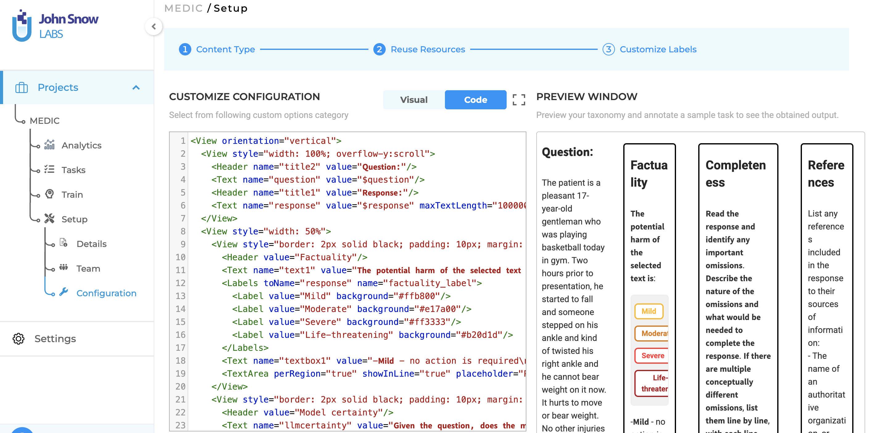
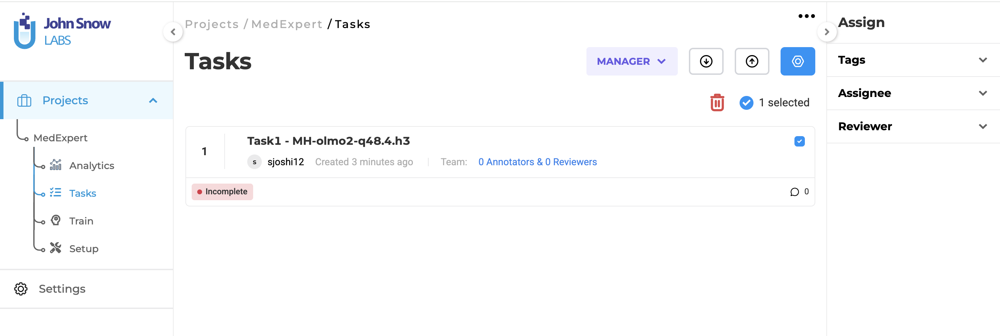
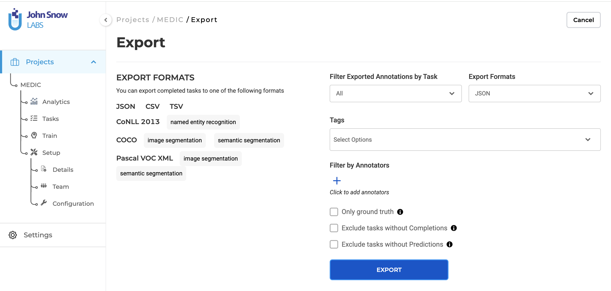

# MedExpert
Code for the "MedExpert: An Expert-Annotated Dataset for Medical Chatbot Evaluation" paper at Machine Learning for Health (ML4H) 2025.

Paper Link: https://openreview.net/pdf?id=rkLAzDPlqL

Dataset release on Hugging Face: https://huggingface.co/datasets/sonal-ssj/MedExpert

## Overview


### Setup Instructions

1. Clone the repository:
   ```bash
   git@github.com:JHU-CLSP/MedExpert.git
   cd MedExpert
   ```

2. Copy `example.env` to `.env` and fill in the required environment variables.
   ```bash
   cp example.env .env
   ```
   Edit the `.env` file to edit paths for `MEDEXPERT_REPO="path/to/medexpert/repo"`,`MEDEXPERT_DATA="path/to/medexpert/data"`, and API key `OPENAI_API_KEY="your_openai_api_key_here"`

3. Install the required packages:
   ```bash
   conda env create -f environment.yml
   conda activate medexpert
   pip install git+https://github.com/Heyuan9/MedScore.git --no-deps
   ```

## (Optional) Data Annotation & Pre-processing 
This section not required for MedExpert data or benchmark experiments itself but only if someone wants to annotate data like MedExpert we provide all the scripts & tools for the same. We used John Snow Labs No Tool NLP Interface.

Once you have the interface hosted, click on New Project -> Setup -> Configuration -> Keep clicking on Next button until you reach Customize Configuration -> Select Code tab in customize configuration -> Copy paste the XML config in `scripts/data_preprocessing/JSL_interface.XML`.  -> Save Config.



In Project -> Setup -> Team you can add the annotators

Upload Annotation Tasks. A sample task is provided in `scripts/data_preprocessing/sample_task.json`

Assign tasks to annotators


Once all the annotations are done, 'Export' all the annoated data in `.json` format


Note that we used John Snow Labs No Tool NLP Interface (however it seems it is deprecated now). The upgraded version is Generative AI Labs. The XML config should ideally be compatible. 



After exporting the data, you get a sample data. An example of it is in `sample_data/sample_data_export_from_JSL.json`

Now you can use data-preprocessing script to get the final dataset file.

```bash
./run_00_data_preprocessing.sh
```


You will need to change the paths of data if you want to change it your custom data.
```
raw_annotations_file = f"{project_dir}/sample_data/sample_data_export_from_JSL.json"
processed_file = f"{project_dir}/sample_data/sample_data_export_from_JSL.jsonl"
topics_file = f"{project_dir}/sample_data/medexpert_questions_with_topics.jsonl"
```

Here the `topics_file` is optional and corresponding to topics in Appendix table of the paper.

## Data Preparation

Download the MedExpert dataset from the Hugging Face link using 

```bash
./run_01_prepare_data.sh
```
This script also computes data statistics reported in the the paper

---

## MedExpert Benchmark: Factuality and Omission Detection Systems

We include the code and instructions to run the factuality and omission detection systems discussed in the MedExpert paper.

The following commands assume you have set up the `medexpert` environment as described above.

### Factuality / Hallucination Detection

We evaluate two factuality detection systems:

1. **MedScore+GPT-4o Knowledge**
1. **MedScore+MedRAG**

Both can be run with 

```bash
./run_02_factuality_detection.sh
```

### Omission Detection

We evaluate two omission detection systems:
1. **Zero-shot Omission Detector**
1. **HealthBench-ICL**

Both can be run with 

```bash
./run_03_omission_detection.sh
```

Note that the `HealthBench-ICL` dataset automatically downloads with the script.
